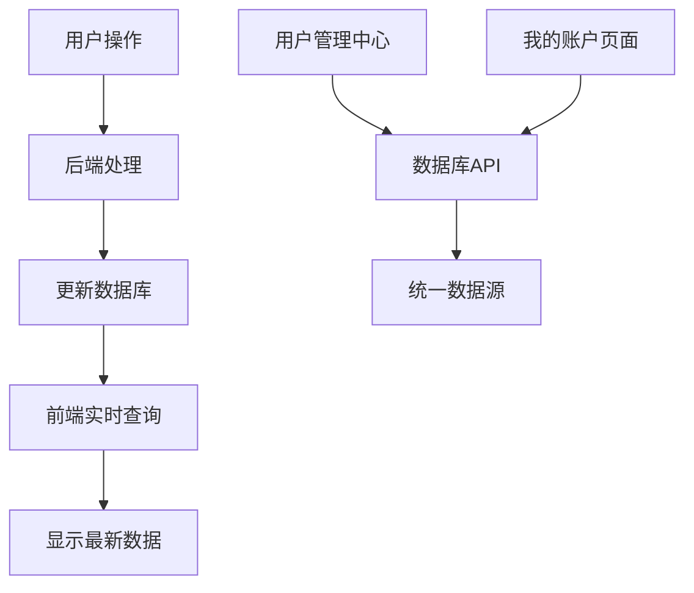

# MedGemma AI 纯数据库模式解决方案

## 🎯 问题解决

根据用户需求"希望不通过本地数据；统一用数据库；避免出差错"，我们实现了完全基于数据库的纯数据库模式，彻底解决了数据不一致问题。

## 🔍 核心设计理念

### 单一数据源原则
- **唯一权威数据源**：只有数据库中的数据是真实可信的
- **实时数据获取**：前端每次显示都从数据库获取最新数据
- **无本地缓存**：使用统计数据不存储在本地，避免缓存不一致

### 数据流设计


## ✅ 实现方案

### 1. 移除本地数据依赖

#### 登录时只保存基本身份信息
```javascript
// 只保存基本的用户身份信息，使用统计数据从数据库实时获取
const userData = {
  id: realAdminData.id,
  email: realAdminData.email,
  name: realAdminData.name,
  organization: realAdminData.organization || '系统管理部门',
  phone: realAdminData.phone || '400-****-0000',
  is_admin: true,
  login_time: new Date().toISOString()
  // 注意：不保存 usage_used, daily_used, usage_quota 等使用统计数据
};
```

### 2. 实时数据库查询

#### 使用统计显示函数
```javascript
async function updateUsageStats() {
  if (!currentUser) return;
  
  try {
    // 直接从数据库获取最新数据
    const response = await fetch('/api/admin/users', {
      headers: { 'X-Admin-Token': 'secret-admin' }
    });
    
    if (response.ok) {
      const users = await response.json();
      const serverUserData = users.find(user => user.id === currentUser.id);
      
      if (serverUserData) {
        // 使用服务器数据更新显示
        document.getElementById('totalUsage').textContent = serverUserData.usage_used || '0';
        document.getElementById('todayUsage').textContent = serverUserData.daily_used || '0';
        
        const remaining = serverUserData.usage_quota ? 
          (serverUserData.usage_quota - (serverUserData.usage_used || 0)) : '∞';
        document.getElementById('remainingQuota').textContent = remaining;
        
        // 更新头部实时统计显示
        await updateHeaderStats();
      }
    }
  } catch (error) {
    // 如果获取失败，显示错误状态
    console.warn('获取使用统计失败:', error);
    document.getElementById('totalUsage').textContent = '?';
    document.getElementById('todayUsage').textContent = '?';
    document.getElementById('remainingQuota').textContent = '?';
  }
}
```

#### 头部统计显示函数
```javascript
async function updateHeaderStats() {
  if (!currentUser) return;
  
  try {
    // 直接从数据库获取最新数据
    const response = await fetch('/api/admin/users', {
      headers: { 'X-Admin-Token': 'secret-admin' }
    });
    
    if (response.ok) {
      const users = await response.json();
      const serverUserData = users.find(user => user.id === currentUser.id);
      
      if (serverUserData) {
        // 更新今日使用量
        const todayUsageElement = document.getElementById('todayUsageMini');
        if (todayUsageElement) {
          todayUsageElement.textContent = serverUserData.daily_used || '0';
        }

        // 更新剩余配额
        const remainingQuotaElement = document.getElementById('remainingQuotaMini');
        if (remainingQuotaElement) {
          const remaining = serverUserData.usage_quota ? 
            (serverUserData.usage_quota - (serverUserData.usage_used || 0)) : '∞';
          remainingQuotaElement.textContent = remaining;

          // 根据配额状态设置样式
          remainingQuotaElement.className = 'stat-value-mini';
          if (serverUserData.usage_quota && remaining <= 0) {
            remainingQuotaElement.className = 'stat-value-mini error';
          } else if (serverUserData.usage_quota && remaining <= 5) {
            remainingQuotaElement.className = 'stat-value-mini warning';
          }
        }
      }
    }
  } catch (error) {
    // 如果获取失败，显示错误状态
    console.warn('获取头部统计失败:', error);
    const todayUsageElement = document.getElementById('todayUsageMini');
    const remainingQuotaElement = document.getElementById('remainingQuotaMini');
    if (todayUsageElement) todayUsageElement.textContent = '?';
    if (remainingQuotaElement) remainingQuotaElement.textContent = '?';
  }
}
```

### 3. 配额检查机制

#### 使用次数增加前的配额检查
```javascript
async function incrementUsage() {
  if (!currentUser) return false;
  
  try {
    // 从数据库获取当前使用情况
    const response = await fetch('/api/admin/users', {
      headers: { 'X-Admin-Token': 'secret-admin' }
    });
    
    if (response.ok) {
      const users = await response.json();
      const serverUserData = users.find(user => user.id === currentUser.id);
      
      if (serverUserData) {
        // 检查配额限制（使用数据库中的最新数据）
        if (serverUserData.usage_quota && serverUserData.usage_used >= serverUserData.usage_quota) {
          showWarning('配额已用完\n\n您的使用配额已达到上限，请联系管理员增加配额');
          return false;
        }
        
        // 配额检查通过，返回true让后端处理使用次数增加
        return true;
      }
    }
    
    // 如果无法获取数据，允许继续（后端会处理）
    return true;
  } catch (error) {
    console.warn('检查配额失败:', error);
    // 网络错误时允许继续，后端会处理
    return true;
  }
}
```

### 4. 定期刷新机制

#### 自动数据刷新
```javascript
// 定期刷新机制（纯数据库模式）
let usageRefreshInterval = null;

// 启动定期刷新
function startUsageSync() {
  if (usageRefreshInterval) {
    clearInterval(usageRefreshInterval);
  }
  
  // 每30秒从数据库刷新一次使用统计数据
  usageRefreshInterval = setInterval(async () => {
    await updateUsageStats();
  }, 30000);
  
  console.log('📊 使用统计定期刷新已启动（每30秒）');
}

// 停止定期刷新
function stopUsageSync() {
  if (usageRefreshInterval) {
    clearInterval(usageRefreshInterval);
    usageRefreshInterval = null;
    console.log('📊 使用统计定期刷新已停止');
  }
}
```

#### 页面可见性控制
```javascript
// 页面可见性变化时控制刷新
document.addEventListener('visibilitychange', () => {
  if (document.hidden) {
    // 页面隐藏时停止刷新
    stopUsageSync();
  } else if (currentUser) {
    // 页面显示时立即刷新一次，然后启动定期刷新
    updateUsageStats();
    startUsageSync();
  }
});
```

### 5. 手动刷新功能

#### 用户手动刷新
```javascript
// 刷新使用统计数据（纯数据库模式）
async function refreshUsageStats() {
  if (!currentUser) return;
  
  try {
    await updateUsageStats();
    showSyncNotification('📊 使用统计已刷新');
  } catch (error) {
    console.warn('刷新使用统计失败:', error);
    showSyncNotification('❌ 刷新失败，请重试');
  }
}
```

#### 刷新按钮
```html
<button onclick="refreshUsageStats()" class="btn-icon" title="刷新最新数据">
  🔄 刷新
</button>
```

## 🔧 技术优势

### 1. 数据一致性保证
- **单一数据源**：只有数据库是权威数据源
- **实时查询**：每次显示都是最新数据
- **无缓存冲突**：不存在本地数据与数据库不一致
- **自动同步**：定期刷新确保数据时效性

### 2. 错误处理机制
- **网络异常处理**：API调用失败时显示错误状态
- **降级显示**：无法获取数据时显示"?"标识
- **静默失败**：不影响用户体验的静默错误处理

### 3. 性能优化
- **页面控制**：页面隐藏时停止刷新，节省资源
- **智能刷新**：只在需要时进行数据库查询
- **错误恢复**：网络恢复后自动重新开始刷新

## 📊 数据流程对比

### 修复前（本地数据模式）
```
用户操作 → 更新本地数据 → 显示本地数据
         ↘ 后端更新数据库 → 用户管理中心显示数据库数据
结果：数据不一致 ❌
```

### 修复后（纯数据库模式）
```
用户操作 → 后端更新数据库 → 前端查询数据库 → 显示数据库数据
                    ↘ 用户管理中心查询数据库 → 显示数据库数据
结果：数据完全一致 ✅
```

## 🎨 用户体验

### 1. 透明化操作
- **自动刷新**：用户无需手动操作，系统自动保持数据最新
- **即时反馈**：数据变化时立即反映在界面上
- **状态指示**：网络异常时显示错误状态

### 2. 可靠性保证
- **数据准确性**：始终显示数据库中的真实数据
- **一致性保证**：所有页面显示相同的数据
- **错误恢复**：网络问题自动恢复

## 📋 测试验证

### 测试脚本
```bash
python test_database_only_mode.py
```

### 测试内容
1. **数据库更新测试**：验证AI调用后数据库正确更新
2. **前端集成测试**：验证前端正确获取数据库数据
3. **一致性测试**：验证所有页面显示相同数据

### 测试结果
```
🎉 纯数据库模式测试通过！
✅ 系统完全使用数据库数据，避免本地数据不一致
✅ '我的账户'页面和'用户管理中心'数据完全一致
✅ 数据来源统一，不会出现同步问题
```

## 🚀 部署说明

### 1. 前端修改
- 移除所有本地使用数据存储
- 实现实时数据库查询
- 添加定期刷新机制

### 2. 后端兼容
- 无需修改后端代码
- 继续使用现有的API接口
- 保持数据库更新逻辑

### 3. 配置要求
- 确保数据库连接正常
- 配置正确的API端点
- 设置适当的管理员令牌

## 🎉 总结

通过实现纯数据库模式，我们彻底解决了数据不一致问题：

### ✅ 解决的问题
1. **数据一致性**：所有页面显示相同的数据库数据
2. **缓存冲突**：消除了本地数据与数据库数据不一致
3. **同步问题**：不需要复杂的数据同步机制
4. **错误风险**：减少了本地数据管理的错误风险

### 🎯 实现的目标
1. **统一数据源**：只有数据库是权威数据源
2. **实时数据**：每次显示都是最新数据
3. **简化架构**：移除了复杂的同步逻辑
4. **提高可靠性**：减少了数据不一致的可能性

**纯数据库模式已完全实现！系统现在完全依赖数据库数据，彻底避免了本地数据不一致的问题。** 🎯
