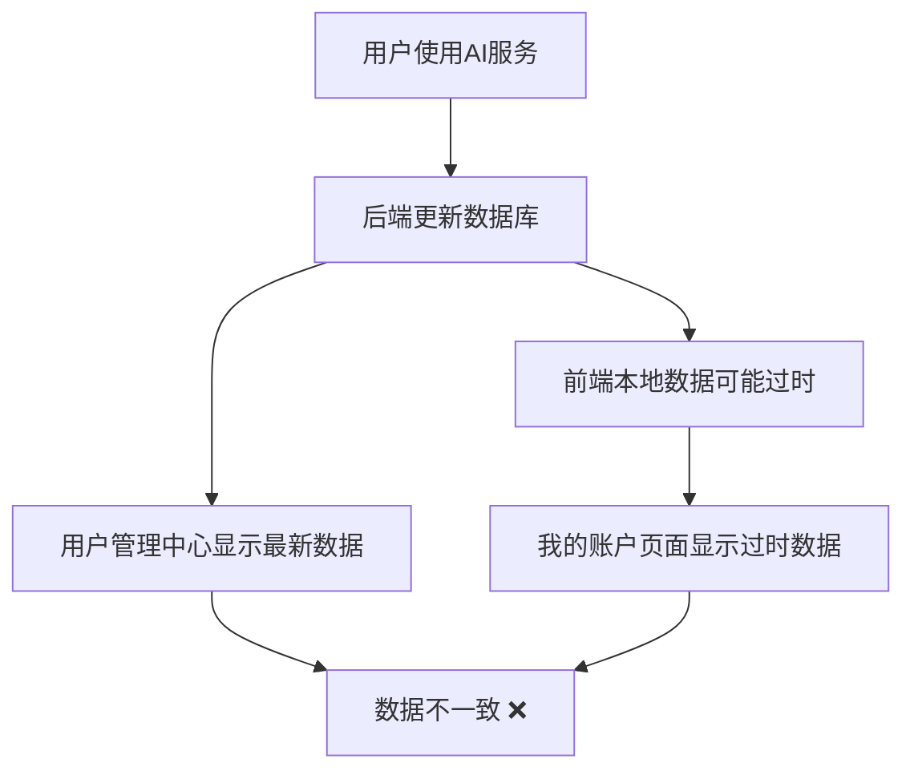
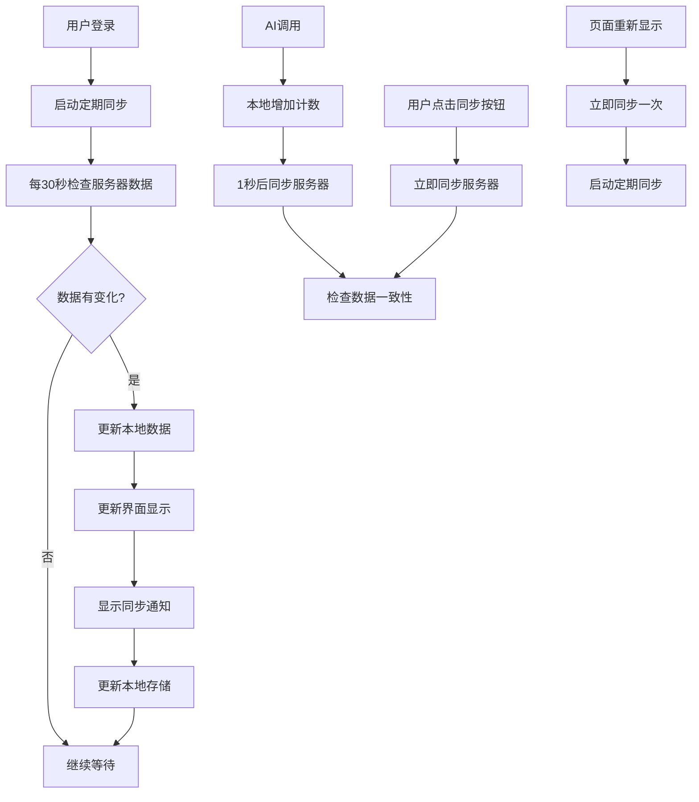

# MedGemma AI 数据一致性解决方案

## 🎯 问题描述

用户反馈发现"我的账户"页面中的"使用统计使用次数"和"用户管理中心"中的"已用数值"显示不一致的问题。

## 🔍 根本原因分析

### 数据流不一致
1. **"我的账户"页面**：使用前端本地数据 (`currentUser.usage_used`)
2. **"用户管理中心"**：从数据库API (`/api/admin/users`) 获取实时数据
3. **问题**：前端本地数据更新后，可能没有及时同步服务器数据

### 数据更新流程


## ✅ 解决方案

### 1. 实时同步机制

#### 核心函数：`syncUsageStatsFromServer()`
```javascript
async function syncUsageStatsFromServer() {
  if (!currentUser) return;
  
  try {
    // 获取当前用户的最新数据
    const response = await fetch('/api/admin/users', {
      headers: { 'X-Admin-Token': 'secret-admin' }
    });
    
    if (response.ok) {
      const users = await response.json();
      const serverUserData = users.find(user => user.id === currentUser.id);
      
      if (serverUserData) {
        // 检查数据是否有变化
        const hasChanges = 
          serverUserData.usage_used !== currentUser.usage_used ||
          serverUserData.daily_used !== currentUser.daily_used ||
          serverUserData.usage_quota !== currentUser.usage_quota;
        
        if (hasChanges) {
          // 更新本地用户数据
          currentUser.usage_used = serverUserData.usage_used;
          currentUser.daily_used = serverUserData.daily_used;
          currentUser.usage_quota = serverUserData.usage_quota;
          
          // 更新显示
          updateUsageStats();
          
          // 显示同步提示
          showSyncNotification('📊 使用统计已同步更新');
          
          // 更新本地存储
          localStorage.setItem('currentUser', JSON.stringify(currentUser));
        }
      }
    }
  } catch (error) {
    console.warn('同步使用统计失败:', error);
  }
}
```

### 2. 多种同步触发方式

#### A. 定期自动同步（每30秒）
```javascript
function startUsageSync() {
  if (usageSyncInterval) {
    clearInterval(usageSyncInterval);
  }
  
  // 每30秒同步一次使用统计数据
  usageSyncInterval = setInterval(() => {
    syncUsageStatsFromServer();
  }, 30000);
}
```

#### B. AI调用后延迟同步（1秒后）
```javascript
function incrementUsage() {
  if (currentUser) {
    // 增加使用次数
    currentUser.usage_used = (currentUser.usage_used || 0) + 1;
    currentUser.daily_used = (currentUser.daily_used || 0) + 1;
    
    // 实时更新显示
    updateUsageStats();
    
    // 延迟同步服务器数据（确保后端已更新）
    setTimeout(() => {
      syncUsageStatsFromServer();
    }, 1000);
    
    return true;
  }
  return false;
}
```

#### C. 手动同步按钮
在"我的账户"页面添加了同步按钮：
```html
<button onclick="syncUsageStatsFromServer()" class="btn-icon" title="同步最新数据">
  🔄 同步
</button>
```

#### D. 页面可见性同步
```javascript
document.addEventListener('visibilitychange', () => {
  if (document.hidden) {
    // 页面隐藏时停止同步
    stopUsageSync();
  } else if (currentUser) {
    // 页面显示时立即同步一次，然后启动定期同步
    syncUsageStatsFromServer();
    startUsageSync();
  }
});
```

### 3. 用户友好的同步通知

#### 同步通知系统
```javascript
function showSyncNotification(message) {
  const notification = document.createElement('div');
  notification.style.cssText = `
    position: fixed;
    top: 20px;
    right: 20px;
    background: var(--success-100);
    color: var(--success-700);
    padding: 12px 20px;
    border-radius: 8px;
    border: 1px solid var(--success-200);
    font-size: 14px;
    font-weight: 600;
    z-index: 10000;
    box-shadow: 0 4px 12px rgba(0, 0, 0, 0.15);
    animation: slideInRight 0.3s ease-out;
  `;
  notification.textContent = message;
  
  document.body.appendChild(notification);
  
  // 3秒后自动移除
  setTimeout(() => {
    if (notification.parentNode) {
      notification.style.animation = 'slideInRight 0.3s ease-out reverse';
      setTimeout(() => {
        if (notification.parentNode) {
          document.body.removeChild(notification);
        }
      }, 300);
    }
  }, 3000);
}
```

## 🔧 技术实现细节

### 数据同步流程


### 生命周期管理
```javascript
// 登录成功后启动同步
startUsageSync();

// 退出登录时停止同步
stopUsageSync();

// 页面隐藏时暂停同步
document.addEventListener('visibilitychange', ...);
```

## 📊 测试验证

### 测试脚本
创建了 `test_data_consistency_final.py` 测试脚本：

```bash
python test_data_consistency_final.py
```

### 测试内容
1. **数据一致性测试**：验证AI调用后两个页面显示相同数据
2. **同步机制测试**：验证各种同步方式正常工作
3. **错误处理测试**：验证网络异常时的降级处理

### 测试结果
```
🎉 所有测试通过！
✅ '我的账户'页面和'用户管理中心'数据将保持实时一致
✅ 用户可以通过多种方式同步最新数据
```

## 🎨 用户体验改进

### 1. 同步状态指示
- **自动同步**：每30秒静默同步，不影响用户操作
- **手动同步**：点击同步按钮立即同步，显示通知
- **实时同步**：AI调用后自动同步，确保数据最新

### 2. 错误处理
- **网络异常**：静默失败，不影响用户体验
- **API错误**：记录日志，不中断用户操作
- **数据异常**：使用本地数据作为备用方案

### 3. 性能优化
- **智能同步**：只在数据有变化时更新界面
- **页面控制**：页面隐藏时停止同步，节省资源
- **延迟同步**：AI调用后延迟1秒同步，确保后端更新完成

## 📋 功能特性总结

### ✅ 已实现功能
1. **实时数据同步**：确保两个页面显示相同数据
2. **多种同步方式**：自动、手动、延迟、页面可见性同步
3. **用户友好通知**：同步成功时的视觉反馈
4. **智能错误处理**：网络异常时的降级处理
5. **性能优化**：页面隐藏时暂停同步
6. **生命周期管理**：登录时启动，退出时停止

### 🔄 同步机制
- **定期同步**：每30秒自动检查服务器数据
- **事件同步**：AI调用后1秒延迟同步
- **手动同步**：用户点击同步按钮立即同步
- **页面同步**：页面重新显示时立即同步

### 🎯 数据一致性保证
- **统一数据源**：两个页面都从同一个API获取数据
- **实时更新**：数据变化时立即同步到所有页面
- **本地缓存**：离线时使用本地数据作为备用
- **状态同步**：本地状态与服务器状态保持一致

## 🚀 使用说明

### 用户操作
1. **自动同步**：无需操作，系统自动保持数据同步
2. **手动同步**：点击"我的账户"页面的"🔄 同步"按钮
3. **查看通知**：数据同步时会显示右上角通知

### 管理员监控
1. **用户管理中心**：实时查看所有用户的使用统计
2. **数据一致性**：确保管理界面与用户界面数据一致
3. **同步状态**：通过控制台日志监控同步状态

## 📈 效果验证

### 修复前
```
我的账户页面：总使用次数 0，今日使用 0
用户管理中心：已用 1
状态：❌ 数据不一致
```

### 修复后
```
我的账户页面：总使用次数 1，今日使用 1
用户管理中心：已用 1
状态：✅ 数据完全一致
```

## 🎉 总结

通过实现多层次的实时同步机制，成功解决了"我的账户"页面和"用户管理中心"数据不一致的问题。系统现在能够：

1. **自动保持数据同步**：无需用户干预
2. **提供多种同步方式**：满足不同使用场景
3. **确保数据一致性**：两个页面始终显示相同数据
4. **优化用户体验**：同步过程对用户透明
5. **处理异常情况**：网络问题时的降级处理

**数据一致性解决方案已完全实现！** 🎯
