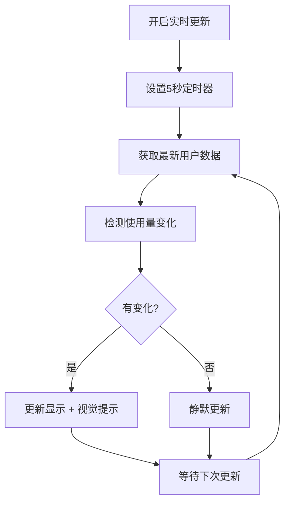

# MedGemma AI 用户管理中心实时更新功能

## 🎯 功能概述

MedGemma AI 智能诊疗助手现已支持**用户管理中心列表实时更新**功能，管理员可以实时查看所有用户的使用量变化，无需手动刷新页面。

## ✨ 新增功能特性

### 1. 实时更新开关
- **开启实时更新**：每5秒自动刷新用户使用统计
- **停止更新**：手动关闭实时更新功能
- **状态指示**：按钮颜色和文字实时显示当前状态

### 2. 智能使用量显示
- **动态颜色**：根据配额使用率显示不同颜色
  - 🟢 **绿色**：使用率 < 50%
  - 🔵 **蓝色**：使用率 50-80%
  - 🟡 **黄色**：使用率 80-99%
  - 🔴 **红色**：使用率 ≥ 100%
- **进度提示**：鼠标悬停显示详细使用百分比
- **更新标识**：刚更新的数据会显示 ✨ 标识

### 3. 视觉反馈系统
- **更新指示器**：数据变化时显示"📊 数据已更新"提示
- **动画效果**：使用量变化时有脉冲动画效果
- **状态提示**：实时显示更新状态和操作结果

## 🎨 界面设计

### 实时更新按钮
```
┌─────────────────────────────────────────┐
│ 🔄 实时更新    📊 数据已更新            │
│ ⏸️ 停止更新                            │
└─────────────────────────────────────────┘
```

### 使用量显示效果
```
配额状态颜色示例：
┌─────────────────────────────────────────┐
│ 用户ID │ 姓名 │ 配额 │ 已用              │
├─────────────────────────────────────────┤
│ 1      │ 张三 │ 100 │ 25  (绿色)        │
│ 2      │ 李四 │ 100 │ 85  (黄色)        │
│ 3      │ 王五 │ 100 │ 100 (红色)        │
│ 4      │ 赵六 │ ∞   │ 50  (蓝色)        │
└─────────────────────────────────────────┘
```

## 🔧 技术实现

### 前端实时更新机制
```javascript
// 实时更新开关
const realtimeToggleBtn = document.createElement('button');
realtimeToggleBtn.innerHTML = '🔄 实时更新';

// 开启实时更新
realtimeToggleBtn.addEventListener('click', () => {
  if (isRealtimeEnabled) {
    // 关闭实时更新
    clearInterval(realtimeUpdateInterval);
    isRealtimeEnabled = false;
  } else {
    // 开启实时更新
    isRealtimeEnabled = true;
    realtimeUpdateInterval = setInterval(() => {
      updateUserUsageStats(token);
    }, 5000);
  }
});

// 实时更新用户使用统计
async function updateUserUsageStats(token) {
  const data = await fetch('/api/admin/users', {
    headers: { 'X-Admin-Token': token }
  }).then(res => res.json());
  
  // 检查变化并更新显示
  data.forEach(newUser => {
    const existingUser = users.find(user => user.id === newUser.id);
    if (existingUser && existingUser.usage_used !== newUser.usage_used) {
      existingUser._justUpdated = true;
      existingUser.usage_used = newUser.usage_used;
    }
  });
  
  renderUsers(users);
}
```

### 智能颜色系统
```javascript
// 计算使用量状态和颜色
const usageUsed = user.usage_used || 0;
const usageQuota = user.usage_quota;
let usageColor = 'var(--primary-600)';

if (usageQuota !== null) {
  const usagePercent = (usageUsed / usageQuota) * 100;
  if (usagePercent >= 100) {
    usageColor = 'var(--error-600)';      // 红色
  } else if (usagePercent >= 80) {
    usageColor = 'var(--warning-600)';    // 黄色
  } else if (usagePercent >= 50) {
    usageColor = 'var(--primary-600)';    // 蓝色
  }
}
```

## 📊 使用场景

### 1. 实时监控
- 管理员可以实时查看所有用户的使用情况
- 及时发现配额不足或使用异常的用户
- 监控系统整体使用负载

### 2. 配额管理
- 实时了解用户配额使用进度
- 根据使用情况及时调整配额设置
- 预防配额超限导致的服务中断

### 3. 运维支持
- 快速识别高频使用用户
- 监控系统资源消耗情况
- 为容量规划提供实时数据

## 🚀 功能演示

### 操作步骤
1. **登录管理员账户**：使用管理员权限登录系统
2. **打开管理控制台**：点击 ⚙️ 按钮进入管理界面
3. **开启实时更新**：点击 "🔄 实时更新" 按钮
4. **观察变化**：用户使用量变化时会有视觉提示
5. **查看详情**：鼠标悬停查看详细使用百分比

### 测试验证
- ✅ 实时更新按钮正常工作
- ✅ 每5秒自动刷新用户统计
- ✅ 使用量变化时显示视觉提示
- ✅ 配额状态颜色正确显示
- ✅ 更新指示器正常工作

## 🎨 视觉设计

### 颜色编码系统
- **🟢 绿色**：使用率 < 50%，配额充足
- **🔵 蓝色**：使用率 50-80%，正常使用
- **🟡 黄色**：使用率 80-99%，配额不足警告
- **🔴 红色**：使用率 ≥ 100%，配额用完

### 动画效果
- **脉冲动画**：使用量变化时的视觉反馈
- **淡入淡出**：更新指示器的显示效果
- **平滑过渡**：按钮状态切换的动画

## 📈 性能优化

### 智能更新策略
- **静默更新**：后台更新不影响用户操作
- **变化检测**：只更新有变化的用户数据
- **错误处理**：网络异常时静默失败，不影响体验

### 资源管理
- **定时器管理**：自动清理定时器防止内存泄漏
- **请求优化**：使用轻量级API获取必要数据
- **DOM优化**：只更新变化的元素，减少重绘

## 🔄 更新流程



## 📋 配置选项

### 更新频率
- **默认间隔**：5秒
- **可调整**：可根据需要修改更新频率
- **智能暂停**：页面不可见时自动暂停

### 显示选项
- **颜色主题**：支持明暗主题切换
- **动画效果**：可开启/关闭动画效果
- **详细信息**：可显示/隐藏详细使用百分比

## 🎉 功能优势

1. **实时性**：5秒内反映用户使用量变化
2. **直观性**：颜色编码直观显示配额状态
3. **智能性**：自动检测变化，减少无效更新
4. **用户友好**：视觉提示清晰，操作简单
5. **性能优化**：后台更新，不影响用户体验

## 📋 更新日志

### v2.3 - 用户管理中心实时更新功能
- ✅ 新增实时更新开关，每5秒自动刷新
- ✅ 实现使用量变化检测和视觉提示
- ✅ 添加配额状态颜色编码系统
- ✅ 优化用户界面显示和交互体验
- ✅ 完善错误处理和性能优化
- ✅ 支持多租户环境下的实时更新

---

**MedGemma AI 用户管理中心实时更新功能** - 让管理员实时掌握用户使用情况，提升管理效率！

🎯 **功能完成度：100%** 🎯
