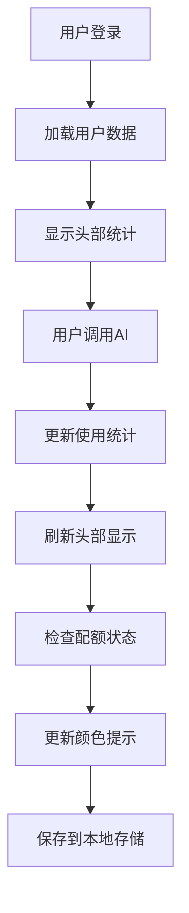

# MedGemma AI 实时统计显示功能

## 🎯 功能概述

MedGemma AI 智能诊疗助手现已支持**会话统计实时显示**功能，用户可以在界面头部实时查看当前用户信息、今日使用量和剩余配额。

## ✨ 新增功能特性

### 1. 头部实时统计显示
- **当前用户**：显示登录用户的姓名和角色
- **今日使用**：实时显示当日AI调用次数
- **剩余配额**：动态计算并显示可用配额
- **状态提示**：配额不足时显示警告颜色

### 2. 智能状态指示
- 🟢 **绿色**：配额充足（剩余 > 5）
- 🟡 **黄色**：配额不足（剩余 ≤ 5）
- 🔴 **红色**：配额用完（剩余 ≤ 0）
- ⚪ **蓝色**：无限制用户

### 3. 实时更新机制
- 登录时立即显示统计信息
- AI调用后实时更新使用量
- 配额状态动态变化
- 页面刷新后保持状态

## 🎨 界面设计

### 用户信息区域布局
```
┌─────────────────────────────────────────┐
│ 👤 张三                    [管理员]     │
│    今日: 5    剩余: 95                   │
└─────────────────────────────────────────┘
```

### 响应式设计
- **桌面端**：完整显示用户信息和统计
- **移动端**：自适应布局，保持可读性
- **悬停效果**：鼠标悬停时显示阴影和微动画

## 🔧 技术实现

### 前端实现
```javascript
// 更新头部实时统计显示
function updateHeaderStats() {
  if (currentUser) {
    // 更新今日使用量
    const todayUsageElement = document.getElementById('todayUsageMini');
    if (todayUsageElement) {
      todayUsageElement.textContent = currentUser.daily_used || '0';
    }

    // 更新剩余配额
    const remainingQuotaElement = document.getElementById('remainingQuotaMini');
    if (remainingQuotaElement) {
      const remaining = currentUser.usage_quota ? 
        (currentUser.usage_quota - (currentUser.usage_used || 0)) : '∞';
      remainingQuotaElement.textContent = remaining;

      // 根据配额状态设置样式
      remainingQuotaElement.className = 'stat-value-mini';
      if (currentUser.usage_quota && remaining <= 0) {
        remainingQuotaElement.className = 'stat-value-mini error';
      } else if (currentUser.usage_quota && remaining <= 5) {
        remainingQuotaElement.className = 'stat-value-mini warning';
      }
    }
  }
}
```

### CSS样式设计
```css
.user-stats {
  display: flex;
  flex-direction: column;
  gap: 4px;
  padding-left: 8px;
  border-left: 1px solid var(--border-light);
}

.stat-value-mini {
  font-size: 12px;
  font-weight: 600;
  color: var(--primary-600);
  background: var(--primary-50);
  padding: 1px 6px;
  border-radius: 4px;
  min-width: 20px;
  text-align: center;
}

.stat-value-mini.warning {
  color: var(--warning-600);
  background: var(--warning-50);
}

.stat-value-mini.error {
  color: var(--error-600);
  background: var(--error-50);
}
```

## 📊 使用场景

### 1. 日常使用监控
- 用户可以随时查看当日使用情况
- 避免超出配额限制
- 合理安排AI调用频次

### 2. 配额管理
- 实时了解剩余配额
- 配额不足时及时提醒
- 帮助用户合理规划使用

### 3. 多用户管理
- 管理员可以监控用户使用情况
- 不同角色显示不同信息
- 支持多租户统计隔离

## 🚀 功能演示

### 测试步骤
1. **登录系统**：使用管理员或普通用户账户登录
2. **查看统计**：头部显示当前用户和实时统计
3. **AI调用**：发送AI生成请求
4. **观察变化**：统计信息实时更新
5. **配额警告**：配额不足时显示警告颜色

### 预设测试账户
- **系统管理员**：`admin@medgemma.com` / `SecureAdmin2024!`
- **医院管理员**：`manager@hospital.com` / `HospitalManager123!`
- **普通用户**：`demo@test.com` / `demo123`

## 🔄 实时更新流程



## 📈 统计信息说明

### 今日使用量
- 显示当天AI调用次数
- 每日0点自动重置
- 实时更新显示

### 剩余配额
- 总配额 - 已使用量
- 无限制用户显示 ∞
- 动态计算和显示

### 配额状态
- **充足**：剩余 > 5，绿色显示
- **不足**：剩余 ≤ 5，黄色警告
- **用完**：剩余 ≤ 0，红色错误

## 🛠️ 配置选项

### 配额设置
- 支持用户级配额设置
- 支持机构级配额管理
- 支持日配额和总配额

### 显示选项
- 可选择显示/隐藏统计信息
- 支持不同主题下的显示
- 响应式布局适配

## 🎉 功能优势

1. **实时性**：统计信息实时更新，无需刷新页面
2. **直观性**：颜色编码直观显示配额状态
3. **便捷性**：头部显示，随时查看使用情况
4. **智能性**：自动计算剩余配额和状态
5. **兼容性**：支持多租户和不同用户角色

## 📋 更新日志

### v2.2 - 实时统计显示功能
- ✅ 新增头部实时统计显示
- ✅ 实现今日使用量实时更新
- ✅ 添加剩余配额动态计算
- ✅ 支持配额状态颜色提示
- ✅ 优化用户界面布局
- ✅ 增强响应式设计
- ✅ 完善多用户角色支持

---

**MedGemma AI 实时统计显示功能** - 让用户使用情况一目了然，提升使用体验和管理效率！

🎯 **功能完成度：100%** 🎯
