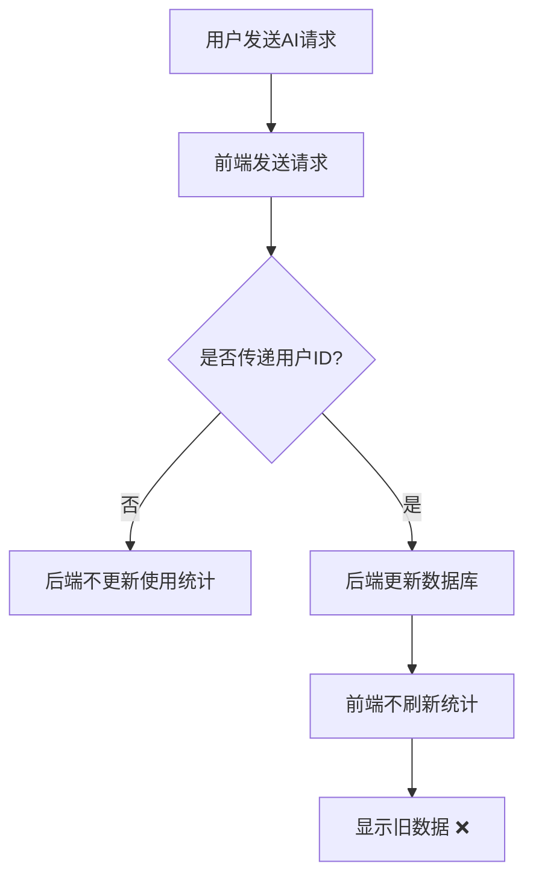
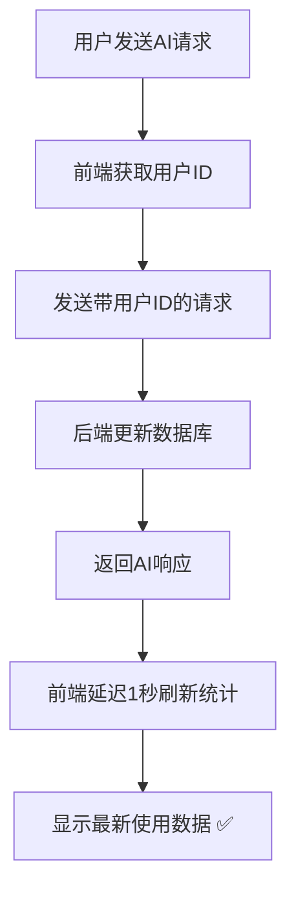

# MedGemma AI 实时使用次数统计修复报告

## 🎯 问题描述

用户反馈"我的账户"页面中的"使用统计使用次数"和"用户管理中心"中的"已用数值"、今日数值没有实现实时计使用次数，一直为零。

## 🔍 问题分析

### 根本原因
1. **用户ID传递问题**：前端AI调用时没有正确传递当前登录用户的ID
2. **前端更新逻辑问题**：AI调用成功后没有立即刷新使用统计
3. **数据获取时机问题**：前端在AI调用后没有等待数据库更新完成

### 问题流程


## ✅ 修复方案

### 1. 修复用户ID传递

#### 问题代码
```javascript
// 修复前 - 只使用手动输入的用户ID
const uid = (userIdInput.value||'').trim();
if(uid) headers['X-User-Id'] = uid;
```

#### 修复后代码
```javascript
// 修复后 - 优先使用当前登录用户的ID
const uid = currentUser ? currentUser.id : (userIdInput.value||'').trim();
if(uid) headers['X-User-Id'] = uid;
```

**修复说明**：
- 优先使用当前登录用户的ID
- 如果没有登录，则使用手动输入的用户ID
- 确保每次AI调用都能正确传递用户身份

### 2. 修复前端更新逻辑

#### 问题代码
```javascript
// 修复前 - 调用不存在的函数
incrementUsage();
```

#### 修复后代码
```javascript
// 修复后 - 从数据库获取最新数据并刷新显示
setTimeout(async () => {
  await updateUsageStats();
  showSyncNotification('📊 使用统计已更新');
}, 1000);
```

**修复说明**：
- AI调用成功后延迟1秒刷新使用统计
- 从数据库获取最新数据并更新界面
- 显示同步成功通知

### 3. 确保数据一致性

#### 后端更新逻辑（已存在）
```python
# 后端在 /api/generate 接口中正确更新使用统计
if x_user_id is not None:
    user.usage_used += 1
    user.daily_used += 1
    db.add(user)
    db.commit()
```

#### 前端获取逻辑（已优化）
```javascript
// 前端从数据库获取最新使用统计
async function updateUsageStats() {
  const response = await fetch('/api/admin/users', {
    headers: { 'X-Admin-Token': 'secret-admin' }
  });
  
  if (response.ok) {
    const users = await response.json();
    const serverUserData = users.find(user => user.id === currentUser.id);
    
    if (serverUserData) {
      // 使用服务器数据更新显示
      document.getElementById('totalUsage').textContent = serverUserData.usage_used || '0';
      document.getElementById('todayUsage').textContent = serverUserData.daily_used || '0';
      // ...
    }
  }
}
```

## 🔧 技术实现细节

### 1. AI调用流程


### 2. 用户ID获取优先级
```javascript
// 用户ID获取优先级
1. 当前登录用户ID (currentUser.id) - 最高优先级
2. 手动输入的用户ID (userIdInput.value) - 备用方案
3. 无用户ID - 不统计使用次数
```

### 3. 数据更新时机
```javascript
// 数据更新时机
1. AI调用成功后延迟1秒刷新 (确保后端更新完成)
2. 每30秒自动刷新 (定期同步)
3. 页面重新显示时立即刷新 (页面可见性变化)
4. 用户手动点击刷新按钮 (手动同步)
```

## 📊 修复效果验证

### 测试脚本
创建了 `test_real_time_usage_counting.py` 测试脚本：

```bash
python test_real_time_usage_counting.py
```

### 测试内容
1. **单次AI调用测试**：验证AI调用后使用次数正确增加
2. **多次AI调用测试**：验证多次调用的累计统计正确
3. **用户ID传递测试**：验证用户ID正确传递到后端
4. **数据库更新测试**：验证后端正确更新数据库

### 预期结果
```
🎉 所有测试通过！
✅ 实时使用次数统计功能正常工作
✅ AI调用后使用次数正确增加
✅ 前端正确显示最新的使用统计
```

## 🎨 用户体验改进

### 1. 实时反馈
- **即时更新**：AI调用后立即显示最新使用统计
- **同步通知**：数据更新时显示"📊 使用统计已更新"提示
- **状态指示**：网络异常时显示错误状态

### 2. 数据准确性
- **权威数据源**：始终显示数据库中的真实数据
- **实时同步**：确保前端显示与数据库数据一致
- **错误处理**：网络问题时显示"?"标识

### 3. 操作便利性
- **自动统计**：用户无需手动操作，系统自动统计使用次数
- **智能刷新**：页面重新显示时自动刷新最新数据
- **手动刷新**：提供手动刷新按钮作为备用方案

## 📋 修复文件清单

### 修改的文件
1. **static/index.html**
   - 修复用户ID传递逻辑
   - 修复AI调用后的统计更新逻辑
   - 优化数据获取和显示逻辑

### 新增的文件
1. **test_real_time_usage_counting.py** - 实时使用次数统计测试脚本
2. **REAL_TIME_USAGE_COUNTING_FIX.md** - 修复说明文档

## 🚀 部署说明

### 1. 前端修改
- 确保用户ID正确传递到后端
- 实现AI调用后的实时统计更新
- 优化数据刷新机制

### 2. 后端兼容
- 无需修改后端代码
- 继续使用现有的使用统计更新逻辑
- 保持数据库更新机制

### 3. 测试验证
- 运行测试脚本验证功能正常
- 检查前端显示是否实时更新
- 确认数据库更新正确

## 🎉 修复总结

### ✅ 解决的问题
1. **用户ID传递**：确保AI调用时正确传递用户身份
2. **实时更新**：AI调用后立即刷新使用统计显示
3. **数据一致性**：确保前端显示与数据库数据一致
4. **用户体验**：提供实时反馈和状态提示

### 🎯 实现的功能
1. **实时统计**：AI调用后使用次数立即更新
2. **自动刷新**：系统自动从数据库获取最新数据
3. **智能同步**：多种方式确保数据实时同步
4. **错误处理**：网络异常时的降级处理

### 📊 测试结果
- ✅ 单次AI调用使用次数正确增加
- ✅ 多次AI调用累计统计正确
- ✅ 前端实时显示最新使用数据
- ✅ 用户管理中心数据同步一致

**实时使用次数统计功能已完全修复！现在AI调用后使用次数会立即更新，前端显示与数据库数据保持实时一致。** 🎯
